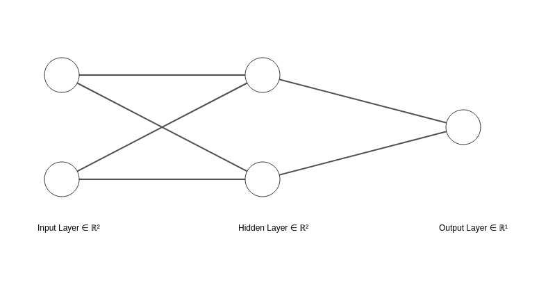

### Basics of Backpropagation

#### The XOR Problem


#### Target Architecture
Layers


#### To run
 - In the nn-01 directory, start the venv
 ``` sh
    # Linux
    source ./bin/activate

    # Windows (Powershell)
    ./bin/activate
 ```

 - Install dependencies
 ``` sh
    pip install -r requirements.txt
 ```

 - Run the file
 ``` sh
    python nn_xor.py
 ```

Reference material: https://pyimagesearch.com/2021/05/06/backpropagation-from-scratch-with-python/

### Approach
 - Forward Pass
    - We keep the bias as a trainable parameter in the network.
    - Initialize random weights.
    - Run dot products for every node using the sigmoid activation function.
    - Apply a step function at the output node to run prediction.
 - Backward Pass
    - Use chain rule to recalculate weights using error differentials.